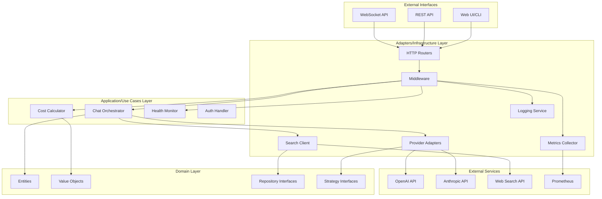
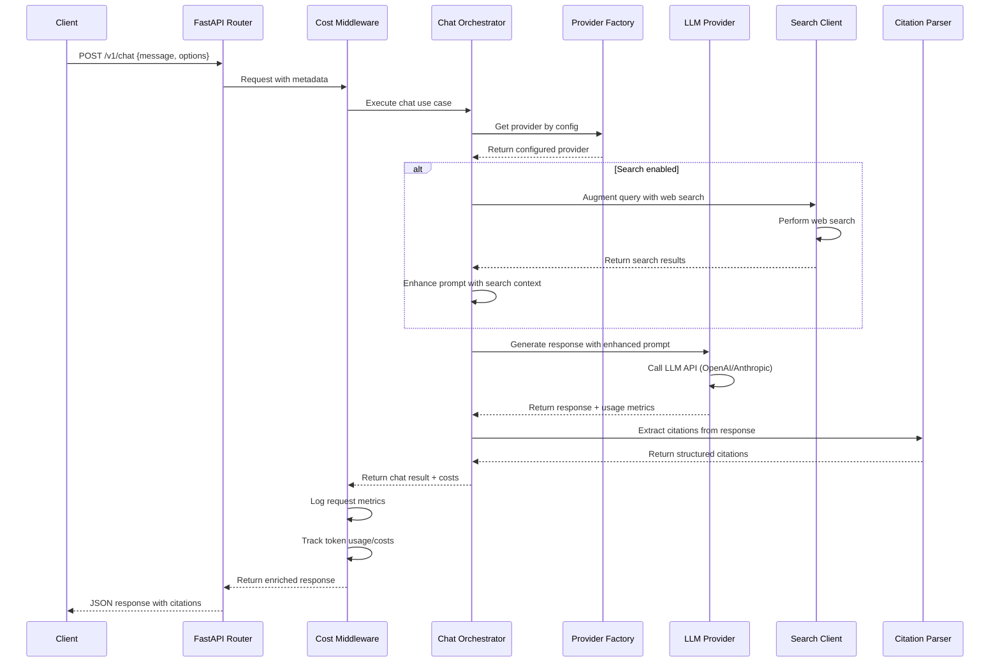
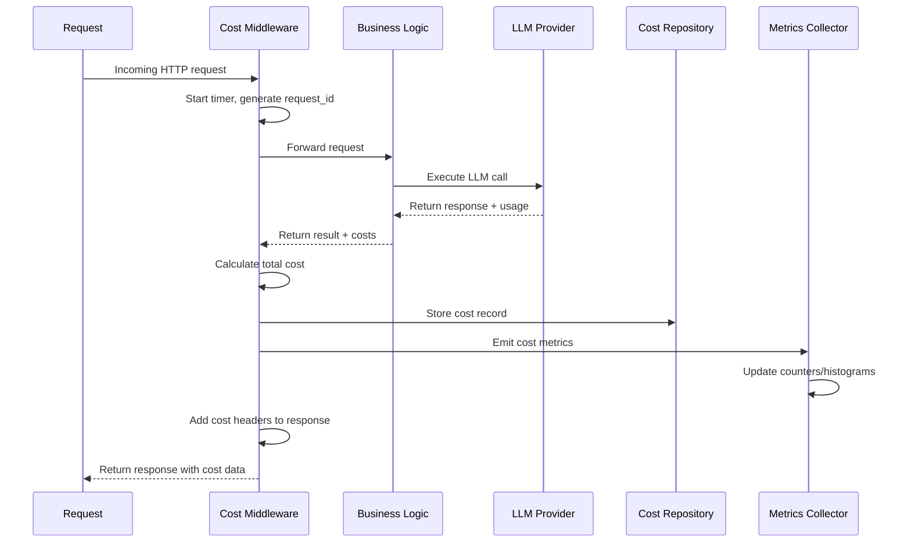
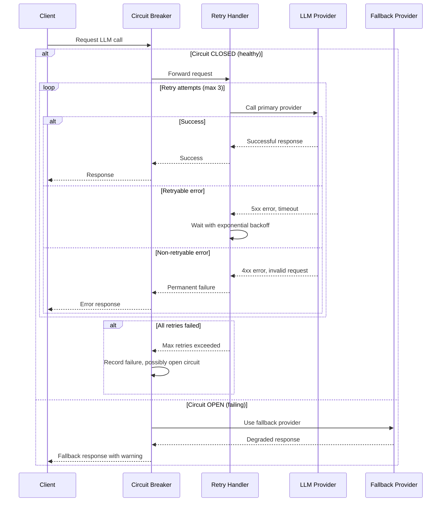
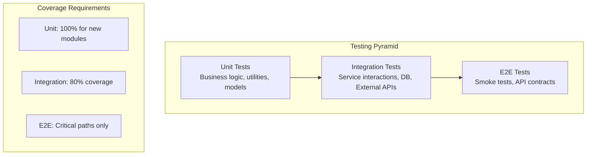

# Enterprise AI Chatbot Architecture Document

## 1. Executive Summary

### System Overview
This enterprise-ready AI Chatbot system is built on a foundation of web search-augmented conversational AI, designed to provide accurate, cited responses through integration with multiple LLM providers (OpenAI, Anthropic/Claude). The system extends the existing web search codebase to create a resilient, scalable chatbot platform with enterprise-grade observability, cost control, and security features.

### Target Users
- **Enterprise teams** requiring AI assistance with reliable source citations
- **Developers** needing web search-augmented AI responses in applications
- **Organizations** requiring cost transparency and usage accountability
- **Compliance teams** needing audit trails and PII protection

### Key Quality Attributes
- **Reliability**: 99.9% uptime with circuit breakers and graceful degradation
- **Cost Transparency**: Real-time token usage tracking and cost reporting per request
- **Privacy**: PII redaction, minimal data retention, secure secrets management
- **Maintainability**: Clean Architecture with SOLID principles, 100% test coverage for new modules
- **Scalability**: Stateless design supporting horizontal scaling
- **Security**: Zero-trust authentication, encrypted data transit, audit logging

## 2. Scope, Goals & Non-Goals

### Goals (Must Have)
- ✅ **Enterprise Readiness**: Production-grade reliability, monitoring, and security
- ✅ **SOLID Principles**: Dependency injection, single responsibility, interface segregation
- ✅ **Clean Architecture**: Domain-driven design with clear layer separation
- ✅ **TDD Approach**: Test-first development with 100% coverage for new modules
- ✅ **Logging + Cost Accounting**: Structured JSON logs with per-request cost tracking
- ✅ **Multi-Environment**: Dev/staging/prod configuration with feature flags
- ✅ **API Resilience**: Retries, circuit breakers, timeout handling, graceful degradation

### Goals (Should Have)
- 🎯 **Chat Interface**: RESTful API with WebSocket support for streaming responses
- 🎯 **Web Search Augmentation**: Integration with existing search capabilities
- 🎯 **Response Citations**: Automatic source citation and fact verification
- 🎯 **Multi-Provider Support**: Strategy pattern for OpenAI/Anthropic switching
- 🎯 **Health/Metrics Endpoints**: Prometheus-compatible observability
- 🎯 **Cost Reporting**: Real-time usage dashboards and budget alerts

### Non-Goals
- ❌ **Multi-tenant Authentication**: Single organization focus initially
- ❌ **Real-time Collaboration**: No shared chat sessions
- ❌ **On-premise Deployment**: Cloud-first architecture
- ❌ **Legacy API Compatibility**: Breaking changes acceptable with migration guide

## 3. Requirements

### Functional Requirements

| Requirement | Description | Priority |
|-------------|-------------|----------|
| **FR-1** | Chat endpoint accepting messages and returning AI responses | P0 |
| **FR-2** | Web search augmentation with automatic source citation | P0 |
| **FR-3** | Multi-provider LLM support (OpenAI, Anthropic) via configuration | P0 |
| **FR-4** | Response parsing with structured citation extraction | P0 |
| **FR-5** | Cost reporting endpoint with real-time usage metrics | P1 |
| **FR-6** | Health check and system metrics endpoints | P1 |
| **FR-7** | Admin endpoints for provider switching and configuration | P2 |

### Non-Functional Requirements

| Category | Requirement | Target | Measurement |
|----------|-------------|--------|-------------|
| **Performance** | Response latency (95th percentile) | < 3 seconds | Application metrics |
| **Performance** | Search augmentation latency | < 5 seconds | Search service SLA |
| **Availability** | System uptime | 99.9% | Health check monitoring |
| **Availability** | Graceful degradation during provider outages | 99% | Circuit breaker metrics |
| **Security** | API authentication | JWT/API key | Security audit |
| **Security** | PII detection and redaction | 100% coverage | Data compliance scan |
| **Cost** | Token usage accuracy | 100% tracking | Cost reconciliation |
| **Cost** | Monthly budget alerting | Real-time | Budget monitoring |
| **Scalability** | Concurrent requests | 1000 req/sec | Load testing |
| **Observability** | Structured logging coverage | 100% of requests | Log analysis |

## 4. High-Level Architecture

### Clean Architecture Layers



### System Components

| Component | Responsibility | Design Pattern |
|-----------|---------------|----------------|
| **API Layer** | FastAPI routers, request/response handling | MVC |
| **Chat Service** | Conversation orchestration, provider selection | Use Case |
| **LLM Provider Strategy** | Abstract provider interface, concrete implementations | Strategy |
| **Web Search Client** | Existing search functionality wrapper | Adapter |
| **Response Parser** | Citation extraction, response formatting | Parser |
| **Cost & Metrics Middleware** | Request-level tracking, aggregation | Decorator |
| **Config/Secrets** | Environment-based configuration | Factory |
| **Circuit Breaker** | Provider failure handling | Circuit Breaker |
| **Repository** | Data persistence abstraction | Repository |
| **Observer** | Metrics and event publishing | Observer |

## 5. Module & Package Structure

### Proposed `src/` Layout

```
src/
├── app/                    # FastAPI application factory and startup
│   ├── __init__.py
│   ├── factory.py          # App factory with dependency injection
│   ├── middleware.py       # Cost tracking, logging, auth middleware
│   └── lifespan.py         # App lifecycle management
├── api/                    # HTTP routers and request/response models
│   ├── __init__.py
│   ├── v1/
│   │   ├── __init__.py
│   │   ├── chat.py         # Chat endpoints
│   │   ├── cost.py         # Cost reporting endpoints
│   │   └── health.py       # Health and metrics endpoints
│   ├── models/
│   │   ├── __init__.py
│   │   ├── requests.py     # Pydantic request models
│   │   ├── responses.py    # Pydantic response models
│   │   └── errors.py       # Error response models (RFC7807)
│   └── dependencies.py     # FastAPI dependency injection
├── domain/                 # Core business entities and interfaces
│   ├── __init__.py
│   ├── entities/
│   │   ├── __init__.py
│   │   ├── conversation.py # Chat conversation entity
│   │   ├── message.py      # Message entity with citations
│   │   └── usage.py        # Token usage and cost entities
│   ├── interfaces/
│   │   ├── __init__.py
│   │   ├── providers.py    # LLM provider interface
│   │   ├── repository.py   # Data persistence interface
│   │   └── search.py       # Search service interface
│   └── value_objects/
│       ├── __init__.py
│       ├── provider_config.py # Provider configuration
│       └── cost_metrics.py    # Cost calculation values
├── usecases/               # Application business logic
│   ├── __init__.py
│   ├── chat/
│   │   ├── __init__.py
│   │   ├── orchestrator.py # Main chat orchestration
│   │   ├── augmenter.py    # Search augmentation logic
│   │   └── citation_processor.py # Citation extraction
│   ├── cost/
│   │   ├── __init__.py
│   │   ├── calculator.py   # Token cost calculation
│   │   └── reporter.py     # Cost reporting and aggregation
│   └── monitoring/
│       ├── __init__.py
│       ├── health_checker.py # System health validation
│       └── metrics_collector.py # Metrics aggregation
├── providers/              # LLM provider implementations (Strategy pattern)
│   ├── __init__.py
│   ├── base.py            # Abstract provider interface
│   ├── openai/
│   │   ├── __init__.py
│   │   ├── client.py      # OpenAI-specific client
│   │   ├── models.py      # OpenAI model configurations
│   │   └── cost_calculator.py # OpenAI pricing logic
│   ├── anthropic/
│   │   ├── __init__.py
│   │   ├── client.py      # Anthropic-specific client
│   │   ├── models.py      # Claude model configurations
│   │   └── cost_calculator.py # Anthropic pricing logic
│   └── factory.py         # Provider factory and registry
├── adapters/               # External service adapters
│   ├── __init__.py
│   ├── search/
│   │   ├── __init__.py
│   │   └── web_client.py  # Wrapper for existing search service
│   ├── persistence/
│   │   ├── __init__.py
│   │   ├── memory.py      # In-memory repository implementation
│   │   └── database.py    # Future database implementation
│   └── monitoring/
│       ├── __init__.py
│       ├── prometheus.py  # Prometheus metrics exporter
│       └── structured_logger.py # JSON logging implementation
├── infrastructure/         # Cross-cutting concerns
│   ├── __init__.py
│   ├── config/
│   │   ├── __init__.py
│   │   ├── settings.py    # Pydantic settings management
│   │   └── secrets.py     # Secure secret loading
│   ├── middleware/
│   │   ├── __init__.py
│   │   ├── cost_tracking.py # Request cost middleware
│   │   ├── error_handling.py # Global error handler
│   │   └── request_logging.py # Request/response logging
│   ├── resilience/
│   │   ├── __init__.py
│   │   ├── circuit_breaker.py # Circuit breaker implementation
│   │   ├── retry.py       # Exponential backoff retry
│   │   └── timeout.py     # Request timeout handling
│   └── security/
│       ├── __init__.py
│       ├── auth.py        # API key authentication
│       └── pii_redactor.py # PII detection and redaction
└── [existing modules]      # Keep existing: client.py, models.py, etc.
    ├── client.py          # Existing web search client
    ├── models.py          # Existing data models
    ├── parser.py          # Existing response parser
    ├── search_service.py  # Existing search service
    ├── logging_config.py  # Existing logging configuration
    └── main.py            # Existing CLI entry point
```

### SOLID Principles Alignment

| Principle | Implementation |
|-----------|----------------|
| **Single Responsibility** | Each module has one reason to change (chat orchestration, cost calculation, provider communication) |
| **Open/Closed** | Provider strategy allows adding new LLMs without modifying existing code |
| **Liskov Substitution** | All LLM providers implement same interface and are interchangeable |
| **Interface Segregation** | Separate interfaces for providers, repositories, and search services |
| **Dependency Inversion** | Use cases depend on interfaces, not concrete implementations |

## 6. Data & API Contracts

### Chat Endpoint Request/Response

```json
// POST /v1/chat
{
  "message": "What are the latest developments in AI?",
  "options": {
    "model": "gpt-4o",
    "search_enabled": true,
    "search_domains": ["arxiv.org", "openai.com"],
    "max_tokens": 1000
  },
  "conversation_id": "optional-uuid-for-context"
}

// Response (200 OK)
{
  "id": "chat-abc123",
  "conversation_id": "conv-xyz789",
  "message": {
    "role": "assistant",
    "content": "Recent AI developments include...",
    "citations": [
      {
        "id": 1,
        "url": "https://arxiv.org/abs/2024.01234",
        "title": "Advanced AI Techniques",
        "start_index": 42,
        "end_index": 128
      }
    ]
  },
  "usage": {
    "prompt_tokens": 150,
    "completion_tokens": 200,
    "total_tokens": 350,
    "cost_usd": 0.0035
  },
  "metadata": {
    "provider": "openai",
    "model": "gpt-4o",
    "search_enabled": true,
    "search_results_count": 5,
    "processing_time_ms": 2340
  },
  "timestamp": "2025-10-20T10:30:00Z"
}
```

### Cost Reporting Endpoint

```json
// GET /v1/costs?start_date=2025-10-01&end_date=2025-10-20
{
  "period": {
    "start_date": "2025-10-01T00:00:00Z",
    "end_date": "2025-10-20T23:59:59Z"
  },
  "summary": {
    "total_requests": 1250,
    "total_tokens": 125000,
    "total_cost_usd": 12.50,
    "average_cost_per_request": 0.01
  },
  "breakdown": {
    "by_provider": {
      "openai": {"requests": 800, "cost_usd": 8.00},
      "anthropic": {"requests": 450, "cost_usd": 4.50}
    },
    "by_model": {
      "gpt-4o": {"requests": 500, "cost_usd": 7.00},
      "gpt-4o-mini": {"requests": 300, "cost_usd": 1.00},
      "claude-3-sonnet": {"requests": 450, "cost_usd": 4.50}
    }
  },
  "daily_usage": [
    {"date": "2025-10-01", "requests": 62, "cost_usd": 0.62},
    {"date": "2025-10-02", "requests": 58, "cost_usd": 0.58}
  ]
}
```

### Error Response Model (RFC7807)

```json
// Error Response (400/500 status codes)
{
  "type": "https://api.example.com/errors/rate-limit-exceeded",
  "title": "Rate Limit Exceeded",
  "status": 429,
  "detail": "API rate limit of 100 requests per minute exceeded",
  "instance": "/v1/chat",
  "timestamp": "2025-10-20T10:30:00Z",
  "request_id": "req-abc123",
  "retry_after": 60,
  "extensions": {
    "current_limit": 100,
    "reset_time": "2025-10-20T10:31:00Z"
  }
}
```

## 7. Sequence Diagrams

### Chat Flow with Provider Strategy and Search Augmentation



### Cost Tracking via Middleware



### Circuit Breaker and Retry Logic



## 8. Logging, Observability, and Cost Accounting

### Structured JSON Logging Schema

```json
{
  "timestamp": "2025-10-20T10:30:00.123Z",
  "level": "INFO",
  "service": "ai-chatbot",
  "version": "1.0.0",
  "request_id": "req-abc123",
  "trace_id": "trace-xyz789",
  "user_id": "user-redacted-hash",
  "event": "chat_request_completed",
  "message": "Chat request processed successfully",
  "duration_ms": 2340,
  "provider": "openai",
  "model": "gpt-4o",
  "tokens": {
    "prompt": 150,
    "completion": 200,
    "total": 350
  },
  "cost_usd": 0.0035,
  "search_enabled": true,
  "search_results": 5,
  "citations_found": 3,
  "status": "success",
  "metadata": {
    "endpoint": "/v1/chat",
    "user_agent": "ChatBot-Client/1.0",
    "ip_address": "redacted"
  }
}
```

### Cost Tracking Middleware Design

```python
# Middleware intercepts every LLM call
@middleware
async def cost_tracking_middleware(request, call_next):
    request_id = generate_request_id()
    start_time = time.time()
    
    # Inject cost tracker into request context
    cost_tracker = CostTracker(request_id=request_id)
    request.state.cost_tracker = cost_tracker
    
    response = await call_next(request)
    
    # Calculate total costs and emit metrics
    total_cost = cost_tracker.get_total_cost()
    duration = time.time() - start_time
    
    # Log structured metrics
    logger.info("request_completed", extra={
        "request_id": request_id,
        "duration_ms": duration * 1000,
        "total_cost_usd": total_cost,
        "provider_calls": cost_tracker.get_provider_breakdown()
    })
    
    # Add cost headers for client visibility
    response.headers["X-Request-Cost"] = str(total_cost)
    response.headers["X-Request-ID"] = request_id
    
    return response
```

### Prometheus Metrics Export

```python
# Counter metrics
chat_requests_total = Counter(
    'chatbot_requests_total',
    'Total number of chat requests',
    ['provider', 'model', 'status']
)

# Histogram metrics
request_duration = Histogram(
    'chatbot_request_duration_seconds',
    'Request processing time',
    ['provider', 'model']
)

# Gauge metrics
current_cost_rate = Gauge(
    'chatbot_cost_rate_usd_per_hour',
    'Current cost burn rate in USD per hour'
)

# Cost tracking
token_costs = Counter(
    'chatbot_token_costs_usd_total',
    'Total token costs in USD',
    ['provider', 'model', 'token_type']
)
```

## 9. Resilience & Reliability

### Retry Configuration

```python
@dataclass
class RetryConfig:
    max_attempts: int = 3
    base_delay: float = 1.0  # seconds
    max_delay: float = 60.0  # seconds
    exponential_base: float = 2.0
    jitter: bool = True
    retryable_status_codes: List[int] = field(default_factory=lambda: [429, 500, 502, 503, 504])
    retryable_exceptions: List[type] = field(default_factory=lambda: [
        httpx.TimeoutException,
        httpx.ConnectError,
        httpx.ReadError
    ])
```

### Circuit Breaker Thresholds

| Parameter | Value | Rationale |
|-----------|-------|-----------|
| **Failure Threshold** | 5 failures in 60 seconds | Prevent cascade failures |
| **Recovery Timeout** | 30 seconds | Allow service recovery time |
| **Half-Open Requests** | 3 requests | Test recovery gradually |
| **Success Threshold** | 2 consecutive successes | Confirm stability before full open |

### Fallback Strategy

```python
class ProviderFallbackStrategy:
    def __init__(self):
        self.primary_provider = "openai"
        self.fallback_providers = ["anthropic", "openai-mini"]
        self.degraded_response_template = {
            "content": "I apologize, but I'm experiencing some technical difficulties. "
                      "Here's a basic response: {fallback_content}",
            "citations": [],
            "warning": "Response generated using fallback provider due to primary service unavailability"
        }
```

## 10. Security & Privacy

### Secrets Management

```python
# Environment-based configuration with validation
@dataclass
class SecretConfig:
    openai_api_key: str = field(default_factory=lambda: os.getenv("OPENAI_API_KEY"))
    anthropic_api_key: str = field(default_factory=lambda: os.getenv("ANTHROPIC_API_KEY"))
    app_secret_key: str = field(default_factory=lambda: os.getenv("APP_SECRET_KEY"))
    
    def __post_init__(self):
        # Validate all secrets are present and properly formatted
        if not self.openai_api_key or not self.openai_api_key.startswith("sk-"):
            raise ValueError("Invalid or missing OpenAI API key")
        
        # Never log secrets - redact in all log outputs
        self._redacted_keys = {
            "openai_api_key": f"sk-****{self.openai_api_key[-4:]}",
            "anthropic_api_key": f"****{self.anthropic_api_key[-4:] if self.anthropic_api_key else 'MISSING'}"
        }
```

### PII Redaction Strategy

```python
class PIIRedactor:
    """Automatically detect and redact PII from prompts and logs."""
    
    patterns = {
        'email': r'\b[A-Za-z0-9._%+-]+@[A-Za-z0-9.-]+\.[A-Z|a-z]{2,}\b',
        'ssn': r'\b\d{3}-\d{2}-\d{4}\b',
        'phone': r'\b\d{3}-\d{3}-\d{4}\b',
        'credit_card': r'\b\d{4}[\s-]?\d{4}[\s-]?\d{4}[\s-]?\d{4}\b'
    }
    
    def redact_prompt(self, prompt: str) -> str:
        """Redact PII from user prompts before sending to LLM."""
        redacted = prompt
        for pii_type, pattern in self.patterns.items():
            redacted = re.sub(pattern, f'[REDACTED_{pii_type.upper()}]', redacted)
        return redacted
    
    def redact_logs(self, log_data: dict) -> dict:
        """Redact PII from log entries before storage."""
        # Implementation details...
```

### Authentication & Authorization

```python
# API Key-based authentication with rate limiting
class APIKeyAuth:
    def __init__(self, rate_limiter: RateLimiter):
        self.rate_limiter = rate_limiter
        self.valid_keys = set(os.getenv("VALID_API_KEYS", "").split(","))
    
    async def authenticate(self, request: Request) -> bool:
        api_key = request.headers.get("X-API-Key")
        if not api_key or api_key not in self.valid_keys:
            raise HTTPException(401, "Invalid API key")
        
        # Rate limiting per API key
        if not await self.rate_limiter.check_limit(api_key):
            raise HTTPException(429, "Rate limit exceeded")
        
        return True
```

## 11. Environment Strategy

### Configuration Matrix

| Setting | Development | Staging | Production |
|---------|-------------|---------|------------|
| **Log Level** | DEBUG | INFO | INFO |
| **Log Format** | Text (colored) | JSON | JSON |
| **Default Provider** | gpt-4o-mini | gpt-4o | gpt-4o |
| **Search Enabled** | True | True | True |
| **Rate Limiting** | Disabled | 100 req/min | 60 req/min |
| **Circuit Breaker** | Disabled | Enabled | Enabled |
| **Cost Alerts** | Disabled | $10/day | $100/day |
| **Retry Attempts** | 1 | 3 | 3 |
| **Metrics Export** | Console | Prometheus | Prometheus |
| **Health Checks** | Basic | Full | Full |

### Environment File Schema

```bash
# .env.example - Copy to .env and configure
# Core API Keys (Required)
OPENAI_API_KEY=sk-your-openai-key-here
ANTHROPIC_API_KEY=your-anthropic-key-here

# Application Configuration
APP_NAME=ai-chatbot
APP_VERSION=1.0.0
ENVIRONMENT=development  # development, staging, production
DEBUG=true

# Server Configuration
HOST=0.0.0.0
PORT=8000
WORKERS=1

# Provider Configuration
DEFAULT_LLM_PROVIDER=openai  # openai, anthropic
DEFAULT_MODEL=gpt-4o-mini
FALLBACK_PROVIDER=anthropic

# Feature Flags
ENABLE_SEARCH_AUGMENTATION=true
ENABLE_COST_TRACKING=true
ENABLE_PII_REDACTION=true
ENABLE_CIRCUIT_BREAKER=true

# Logging Configuration
LOG_LEVEL=INFO  # DEBUG, INFO, WARNING, ERROR
LOG_FORMAT=json  # json, text
LOG_DIR=logs
LOG_RETENTION_DAYS=30

# Cost & Rate Limiting
DAILY_COST_LIMIT_USD=100.00
RATE_LIMIT_REQUESTS_PER_MINUTE=60
COST_ALERT_THRESHOLD_USD=80.00

# Monitoring & Observability
PROMETHEUS_ENABLED=true
PROMETHEUS_PORT=9090
HEALTH_CHECK_ENABLED=true
METRICS_EXPORT_INTERVAL=60

# Security
API_KEY_REQUIRED=true
VALID_API_KEYS=key1,key2,key3
JWT_SECRET_KEY=your-jwt-secret-here
CORS_ALLOWED_ORIGINS=https://yourdomain.com

# Circuit Breaker Configuration
CIRCUIT_BREAKER_FAILURE_THRESHOLD=5
CIRCUIT_BREAKER_RECOVERY_TIMEOUT=30
CIRCUIT_BREAKER_HALF_OPEN_MAX_CALLS=3
```

### Dockerfile

```dockerfile
FROM python:3.12-slim

WORKDIR /app

# Install system dependencies
RUN apt-get update && apt-get install -y \
    gcc \
    && rm -rf /var/lib/apt/lists/*

# Copy requirements and install Python dependencies
COPY requirements.txt .
RUN pip install --no-cache-dir -r requirements.txt

# Copy application code
COPY src/ ./src/
COPY docs/ ./docs/

# Create non-root user
RUN useradd --create-home --shell /bin/bash appuser
RUN chown -R appuser:appuser /app
USER appuser

# Expose port
EXPOSE 8000

# Health check
HEALTHCHECK --interval=30s --timeout=10s --start-period=60s --retries=3 \
    CMD curl -f http://localhost:8000/health || exit 1

# Run application
CMD ["uvicorn", "src.app.factory:create_app", "--host", "0.0.0.0", "--port", "8000"]
```

### Makefile

```makefile
.PHONY: install test lint format run docker-build docker-run clean

# Development commands
install:
	pip install -r requirements.txt
	pip install -r requirements-dev.txt

test:
	pytest tests/ --cov=src --cov-report=term-missing --cov-fail-under=100

test-integration:
	pytest tests/ -m integration --cov=src

lint:
	pylint src/ tests/
	isort --check-only src/ tests/
	black --check src/ tests/

format:
	isort src/ tests/
	black src/ tests/

# Run development server
run:
	uvicorn src.app.factory:create_app --reload --host 0.0.0.0 --port 8000

# Docker commands
docker-build:
	docker build -t ai-chatbot:latest .

docker-run:
	docker run -p 8000:8000 --env-file .env ai-chatbot:latest

# Cleanup
clean:
	find . -type f -name "*.pyc" -delete
	find . -type d -name "__pycache__" -delete
	rm -rf .coverage htmlcov/

# CI commands
ci-test: lint test
ci-build: docker-build
ci-deploy: ci-test ci-build
```

## 12. Testing Strategy

### Testing Pyramid



### Test Categories & Examples

| Test Category | Coverage Target | Examples |
|---------------|----------------|----------|
| **Unit Tests** | 100% for new modules | Provider strategy, cost calculation, PII redaction |
| **Contract Tests** | 100% of interfaces | LLM provider interface, repository interface |
| **Integration Tests** | 80% of integrations | FastAPI routes, external API calls, middleware |
| **E2E Tests** | Critical user journeys | Complete chat flow, cost reporting, health checks |

### Mock Strategy

```python
# Deterministic LLM mocking for consistent testing
@pytest.fixture
def mock_openai_provider():
    with patch('src.providers.openai.client.OpenAI') as mock:
        mock_response = ChatCompletion(
            id="test-id",
            choices=[Choice(message={"role": "assistant", "content": "Test response"})],
            usage=Usage(prompt_tokens=10, completion_tokens=20, total_tokens=30)
        )
        mock.return_value.chat.completions.create.return_value = mock_response
        yield mock

# Web search mocking with realistic data
@pytest.fixture
def mock_search_service():
    with patch('src.adapters.search.web_client.WebSearchClient') as mock:
        mock_result = SearchResult(
            query="test query",
            text="Test search result",
            citations=[Citation("https://example.com", "Example", 0, 10)],
            sources=[Source("https://example.com", "web")],
            search_id="test-id",
            timestamp=datetime.now()
        )
        mock.return_value.search.return_value = mock_result
        yield mock
```

### Test Execution Commands

```bash
# Run all tests with coverage
pytest tests/ --cov=src --cov-report=term-missing --cov-fail-under=100

# Run only new module tests
pytest tests/test_providers/ tests/test_usecases/ --cov=src/providers --cov=src/usecases --cov-fail-under=100

# Run integration tests
pytest tests/ -m integration

# Run with specific markers
pytest tests/ -m "not slow"

# Generate HTML coverage report
pytest tests/ --cov=src --cov-report=html
open htmlcov/index.html
```

## 13. Risks & Mitigations

### Risk Matrix

| Risk | Probability | Impact | Mitigation Strategy |
|------|-------------|--------|-------------------|
| **Provider Rate Limits** | High | High | Circuit breaker, fallback providers, rate limiting |
| **Cost Spikes** | Medium | High | Real-time monitoring, budget alerts, automatic throttling |
| **Prompt Injection** | Medium | Medium | Input sanitization, content filtering, response validation |
| **Stale Search Results** | Medium | Low | Cache TTL, freshness indicators, source date validation |
| **Dependency Vulnerabilities** | Low | High | Automated security scanning, regular updates, pinned versions |
| **API Key Exposure** | Low | High | Environment variables, secrets management, key rotation |
| **PII Leakage** | Low | High | Automatic redaction, audit logging, compliance scanning |

### Monitoring & Alerting

```python
# Critical alerts that require immediate response
alerts = {
    "cost_threshold_exceeded": {
        "condition": "daily_cost_usd > DAILY_COST_LIMIT",
        "action": "throttle_requests",
        "notification": "slack + email"
    },
    "error_rate_high": {
        "condition": "error_rate_5min > 0.05",  # 5% error rate
        "action": "activate_circuit_breaker",
        "notification": "slack"
    },
    "response_time_degraded": {
        "condition": "p95_response_time > 10s",
        "action": "scale_up",
        "notification": "slack"
    },
    "provider_failure": {
        "condition": "provider_availability < 0.95",
        "action": "switch_to_fallback",
        "notification": "email"
    }
}
```

## 14. Implementation Plan & Milestones

### Phase 1: Foundation & Core Chat (Weeks 1-2)

**Deliverables:**
- ✅ Provider Strategy implementation (OpenAI + Anthropic)
- ✅ Cost tracking middleware with structured logging
- ✅ Basic chat endpoint with FastAPI
- ✅ Circuit breaker and retry logic
- ✅ Environment configuration and secrets management

**DONE Criteria:**
- [ ] All provider tests pass with 100% coverage
- [ ] Cost tracking captures token usage accurately
- [ ] Chat endpoint responds with proper error handling
- [ ] Environment variables load correctly in all environments
- [ ] Circuit breaker activates during provider failures

**Test Deliverables:**
- [ ] Unit tests for provider strategy pattern
- [ ] Integration tests for cost middleware
- [ ] Contract tests for chat endpoint
- [ ] End-to-end smoke test for complete chat flow

### Phase 2: Search Augmentation & Citations (Weeks 3-4)

**Deliverables:**
- ✅ Integration with existing web search service
- ✅ Citation extraction and response parsing
- ✅ Search-augmented chat orchestration
- ✅ Enhanced response models with structured citations
- ✅ PII redaction and security measures

**DONE Criteria:**
- [ ] Search augmentation enhances response quality
- [ ] Citations accurately reference source material
- [ ] PII detection catches common sensitive data
- [ ] Search failures gracefully degrade to non-augmented responses
- [ ] Response parsing handles various citation formats

**Test Deliverables:**
- [ ] Unit tests for citation extraction logic
- [ ] Integration tests for search service adapter
- [ ] Mock-based tests for search failure scenarios
- [ ] PII redaction accuracy tests

### Phase 3: Observability & Production Readiness (Weeks 5-6)

**Deliverables:**
- ✅ Cost reporting endpoints and aggregation
- ✅ Health check and metrics endpoints
- ✅ Prometheus metrics export
- ✅ Comprehensive monitoring dashboards
- ✅ CI/CD pipeline with automated testing

**DONE Criteria:**
- [ ] Cost reports accurately reflect actual usage
- [ ] Health checks validate all system dependencies
- [ ] Metrics provide actionable insights for operations
- [ ] Alerts trigger correctly for critical conditions
- [ ] CI pipeline enforces 100% test coverage

**Test Deliverables:**
- [ ] Integration tests for cost reporting accuracy
- [ ] Health check validation tests
- [ ] Metrics collection and export tests
- [ ] Load testing for performance validation

---

## Implementation Checklist

### What I will implement next:

| Priority | Task | Effort | Dependencies |
|----------|------|--------|--------------|
| **P0** | Provider Strategy Pattern (OpenAI + Anthropic base) | 2 days | None |
| **P0** | Cost Tracking Middleware with JSON logging | 2 days | Provider strategy |
| **P0** | FastAPI app factory and basic chat endpoint | 1 day | Cost middleware |
| **P0** | Environment configuration and secrets management | 1 day | None |
| **P1** | Circuit breaker and retry logic | 2 days | Provider strategy |
| **P1** | Search service adapter and orchestration | 2 days | Existing search code |
| **P1** | Citation extraction and response parsing | 2 days | Search adapter |
| **P2** | Health checks and metrics endpoints | 1 day | App factory |
| **P2** | Cost reporting and aggregation endpoints | 2 days | Cost middleware |

### Tests I will write next:

| Test Type | Coverage | Module | Effort |
|-----------|----------|--------|--------|
| **Unit** | 100% | `src/providers/` | 1 day |
| **Unit** | 100% | `src/infrastructure/middleware/` | 1 day |
| **Contract** | 100% | Provider interface compliance | 0.5 day |
| **Integration** | 80% | FastAPI endpoints with middleware | 1 day |
| **Integration** | 80% | Search service integration | 0.5 day |
| **E2E** | Critical paths | Complete chat flow with search | 1 day |
| **E2E** | Critical paths | Cost tracking end-to-end | 0.5 day |

**Total Estimated Effort: 2.5 weeks for full implementation**

---

*This architecture document serves as the blueprint for building an enterprise-ready AI Chatbot with search augmentation, cost transparency, and production-grade reliability. Each component follows clean architecture principles and SOLID design patterns to ensure maintainability and testability.*
